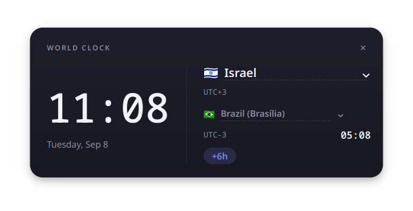

# World Clock

A minimalist desktop clock for Linux (KDE Plasma) that shows the time of a chosen country side by side with Brasília time, including the time zone and the hour difference between the two.



## Features

- Real-time clock for the selected country, next to Brazil's time
- Time zone (UTC±X) and hour difference calculated automatically (accounts for daylight saving time)
- About 40 pre-loaded countries, each with a flag, in a searchable picker
- Dark, minimalist design with rounded corners and a soft shadow
- Borderless, draggable window, optionally always on top
- Remembers the last selected country between runs

## Requirements

- Linux with a graphical session (tested on Fedora with KDE Plasma / Wayland)
- Python 3.9+
- [PySide6](https://pypi.org/project/PySide6/)

## Installation

```bash
git clone https://github.com/<your-username>/world-clock.git
cd world-clock
pip install -r requirements.txt
```

## Usage

```bash
python3 world_clock.py
```

- Click the country name (dashed underline) to change the country
- Click and drag any empty area of the window to move it
- Click the "×" in the top-right corner to close

### Application menu shortcut (KDE Plasma)

To launch it from the Plasma menu like any other app, create `~/.local/share/applications/world-clock.desktop` with the following content (adjust the `Exec` path to wherever you cloned the project):

```ini
[Desktop Entry]
Type=Application
Name=World Clock
Comment=Time in countries around the world compared to Brasília time
Exec=python3 /full/path/to/world-clock/world_clock.py
Icon=clock
Terminal=false
Categories=Utility;Clock;
```

Then run `update-desktop-database ~/.local/share/applications` and look for "World Clock" in the menu.

## Adding or removing countries

The country list lives at the top of [world_clock.py](world_clock.py), in the `COUNTRIES` constant. Each entry is a tuple of `(display name, IANA time zone, ISO country code)`:

```python
("Portugal", "Europe/Lisbon", "PT"),
```

The two-letter code is used to generate the flag automatically — no need to add emoji by hand. Time zones follow the [IANA time zone database](https://en.wikipedia.org/wiki/List_of_tz_database_time_zones).

## Tech stack

- [PySide6](https://doc.qt.io/qtforpython/) (Qt6) for the interface
- `zoneinfo` (Python standard library) for time zone calculations

## License

Distributed under the MIT License. See [LICENSE](LICENSE) for details.
